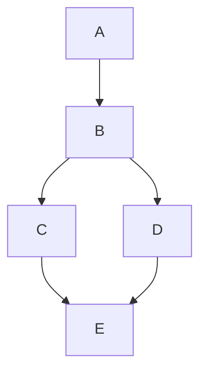

**This is the first test blog post, which aims to see how the post creation goes and how to modify the post properties like font, math, diagram and codes.**

## Examples:

### Code

**Try code examples:**
```python
import pandas as pd
import torch
print("hello world!")
```
### Math

**Try math latex block:**
$$L_{total} = \alpha L_c(x, c) + \beta L_s(x, s) + \gamma L_{tv}$$

### Diagram

**Try diagram example:**


